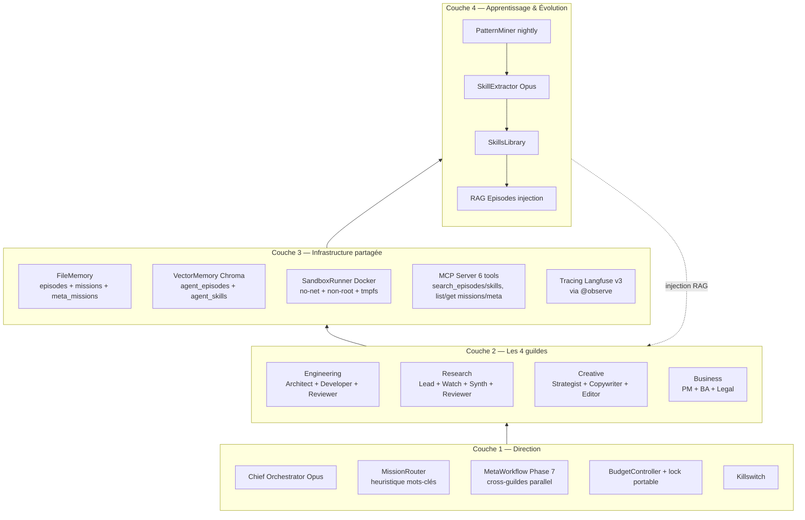
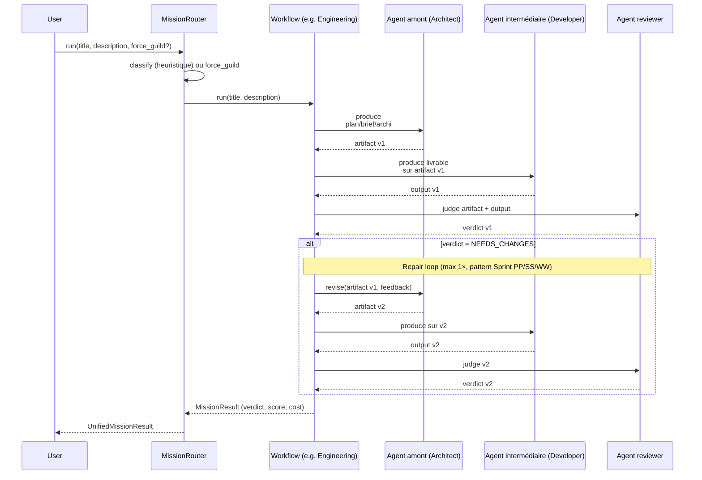
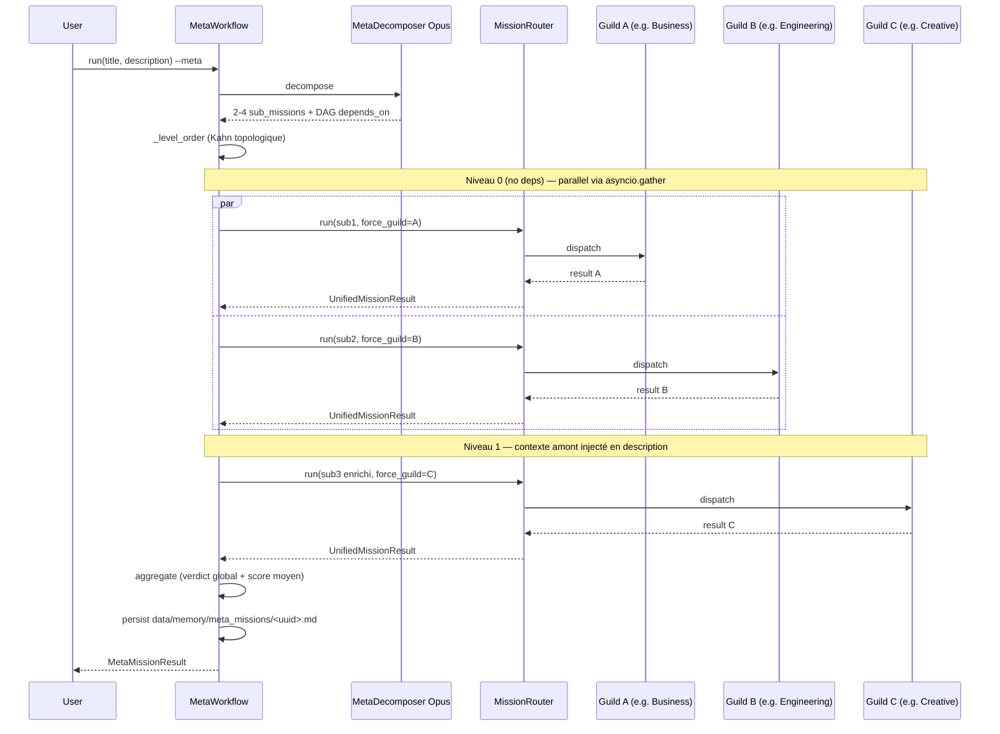

# Architecture — IA Expert Army

> Document vivant — mis à jour à chaque phase.
> Dernière révision : 2026-05-20 (v0.4.0, post-bascule Ollama [ADR-025], Session 3 — nettoyage des fictions).
>
> **Convention de lecture** : chaque composant est tagué **✅ Livré** (présent en code, testé) ou **⏳ Planifié** (mentionné pour vision, pas encore implémenté). Ne te fie qu'aux ✅ pour ce qui tourne aujourd'hui.

---

## Vue d'ensemble — 4 couches



### ASCII fallback (pour `git log` / terminaux sans mermaid)

```
┌──────────────────────────────────────────────────────────────────┐
│  COUCHE 4 — APPRENTISSAGE & ÉVOLUTION                            │
│  Outcome tracking · Pattern mining · Few-shot library            │
│  Prompt refinement loop[⏳] · Periodic fine-tuning[⏳]            │
└──────────────────────────────────────────────────────────────────┘
                              ▲
┌──────────────────────────────────────────────────────────────────┐
│  COUCHE 3 — INFRASTRUCTURE PARTAGÉE                              │
│  Mémoire (Files + Vector DB + KG[⏳]) · MCP · Bus[⏳] · Sandbox · Obs.│
└──────────────────────────────────────────────────────────────────┘
                              ▲
┌──────────────────────────────────────────────────────────────────┐
│  COUCHE 2 — LES 4 GUILDES SPÉCIALISÉES (14 livrés, 11 ⏳)        │
│  Engineering · Research · Creative · Business                    │
└──────────────────────────────────────────────────────────────────┘
                              ▲
┌──────────────────────────────────────────────────────────────────┐
│  COUCHE 1 — COMITÉ DE DIRECTION                                  │
│  Chief Orchestrator · Chief of Staff[⏳] · Quality Guardian      │
│  · Budget Controller · Killswitch                                │
└──────────────────────────────────────────────────────────────────┘

  [⏳] = vision Phase 8+, non implémenté actuellement (cf. tableaux ci-dessous)
```

---

## Flow — Mission single-guild (avec repair loop)



**Repair loop : pourquoi tous les agents amont sont ré-exécutés** (et pas juste l'agent intermédiaire) — cf. **Sprint PP** (Business) / **SS** (Engineering) / **WW** (Research+Creative). Un reviewer peut flagger une issue à n'importe quel niveau ; l'agent intermédiaire seul ne peut pas remédier à une faille amont (plan, brief, archi). Pattern uniformé sur les 4 workflows.

---

## Flow — Meta-mission cross-guildes (Phase 7)



**Stratégie de décomposition** : 100 % LLM (Opus), pas d'heuristique. Le décomposeur adapte selon le contexte (diamond, all-parallel, chain). Cf. [ADR-009](adr/009-meta-workflow-cross-guilds.md).

---

## État d'implémentation (v0.4.0) vs Vision stratégique

| Couche | Composant | Statut | Détail |
|---|---|---|---|
| **C1** | Chief Orchestrator | ✅ Livré | `src/orchestrator/agents/orchestrator.py` |
| C1 | Quality Guardian (opt-in) | ✅ Livré (Sprint YY, [ADR-011](adr/011-quality-guardian.md)) | `src/orchestrator/quality_guardian.py` |
| C1 | Budget Controller (no-op si cap ≤ 0) | ✅ Livré | `src/core/budget.py` + lock portable (Sprint VV) + `is_disabled` property (v0.4.0) |
| C1 | Killswitch sentinelle fichier | ✅ Livré | `src/core/killswitch.py` |
| C1 | Chief of Staff | ⏳ Planifié | Vision Phase 8+. MissionRouter couvre le routage simple actuel. |
| **C2** | Guildes opérationnelles (14 agents livrés / 25 vision) | ✅ Livré | Cf. tableau Couche 2 détaillé |
| C2 | Repair loop uniformé (1× sur NEEDS_CHANGES) | ✅ Livré | Sprint PP/SS/WW — 4 workflows |
| C2 | MetaWorkflow cross-guildes (Phase 7, DAG topologique + asyncio.gather par niveau) | ✅ Livré | `src/orchestrator/meta_workflow.py` ([ADR-009](adr/009-meta-workflow-cross-guilds.md)) |
| C2 | Security Auditor (opt-in, OWASP) | ✅ Livré | `src/orchestrator/agents/security_auditor.py` ([ADR-012](adr/012-security-auditor.md)) |
| **C3** | FileMemory (4 niveaux : working/episodes/missions/meta_missions) | ✅ Livré | `src/memory/file_memory.py` |
| C3 | VectorMemory Chroma (in-process, 2 collections) | ✅ Livré | `src/memory/vector_memory.py` |
| C3 | SQLite knowledge graph | ⏳ Planifié | FileMemory markdown+YAML couvre le besoin actuel |
| C3 | MCP server `memory_search` (6 tools stdio) | ✅ Livré | `src/mcp_servers/memory_search.py` |
| C3 | MCP servers `skills_mcp`/`sandbox_mcp`/`web_mcp`/`notify_mcp` | ⏳ Planifié | Vision uniquement |
| C3 | Redis pubsub bus | ⏳ Planifié | Container démarré mais zéro `import redis` dans src/ |
| C3 | SandboxRunner Docker | ✅ Livré | `src/sandbox/runner.py` ([ADR-008](adr/008-sandbox-readonly-tradeoff.md)) |
| C3 | apply_files (whitelist + path traversal) | ✅ Livré | `src/tools/apply_files.py` |
| C3 | Notifier mobile (Discord/Slack/Telegram/generic) | ✅ Livré | `src/core/notifier.py` ([ADR-018](adr/018-mobile-notifications.md)) |
| C3 | Langfuse self-hosted v3 | ⚠️ Stack démarre mais migration ClickHouse échoue | Workaround : structlog + Langfuse cloud |
| **C4** | PatternMiner + SkillExtractor | ✅ Livré | `src/learning/` ([ADR-006](adr/006-mining-strategy-and-eligibility.md)) |
| C4 | SkillsLibrary + RAG injection à chaque appel | ✅ Livré | 16 skills auto-générées, citation observée en prod |
| C4 | Prompt A/B testing | ⏳ Planifié | [ADR-007](adr/007-prompt-ab-testing-strategy.md) Proposed — code non écrit |
| C4 | Fine-tuning périodique | ⏳ Reporté | Hors scope ([ADR-004](adr/004-learning-strategy.md)) |
| **Bascule v0.4.0** | Backend LLM Ollama local (OpenAI-compatible) | ✅ Livré | [ADR-025](adr/025-bascule-anthropic-to-ollama.md) — 1ʳᵉ mission validée APPROVED 0.93 |

---

## Couche 1 — Comité de direction

Modèles par tier (configurables via `.env` — bascule Ollama local par défaut depuis v0.4.0 / [ADR-025](adr/025-bascule-anthropic-to-ollama.md)) :

| Agent | Statut | Tier (modèle par défaut) | Responsabilité |
|-------|--------|--------------------------|----------------|
| Chief Orchestrator | ✅ Livré | strategic (`qwen2.5:32b`) | Reçoit la mission, la décompose en YAML — code : `src/orchestrator/agents/orchestrator.py` |
| Quality Guardian | ✅ Livré (opt-in `ENABLE_QUALITY_GUARDIAN`) | strategic (`qwen2.5:32b`) | Peer review méta cross-guilde (alignement promesse↔livraison) — code : `src/orchestrator/quality_guardian.py`. Politique : n'override JAMAIS le verdict guilde, ajoute des champs `qg_*` informatifs ([ADR-011](adr/011-quality-guardian.md)) |
| Budget Controller | ✅ Livré (no-op si cap ≤ 0) | n/a (lock fichier + JSON) | Plafond USD/jour + lock portable `O_CREAT\|O_EXCL` cross-process — code : `src/core/budget.py`. Désactivé par défaut depuis ADR-025 (Ollama gratuit). |
| Killswitch | ✅ Livré | n/a (sentinelle fichier) | Arrêt d'urgence universel (zéro dépendance) — code : `src/core/killswitch.py` |
| Chief of Staff | ⏳ Planifié | — | Coordination inter-guildes + reports. Pas de code actuellement, mention historique pour vision Phase 4+. Le MissionRouter (`src/orchestrator/router.py`) couvre le routage simple ; un Chief of Staff serait nécessaire pour de la coordination cross-mission persistante. |

**Pattern d'orchestration actuel** : pipeline séquentiel par guilde + MetaWorkflow cross-guildes en DAG (Kahn topologique). Implémenté en Python natif (asyncio + Pydantic), pas LangGraph — le projet l'a évoqué dans la vision initiale mais n'a jamais introduit la dépendance.

---

## Couche 2 — Les 4 Guildes (14 agents livrés, 11 planifiés)

Tiers configurables via `.env`. Tous les modèles par défaut sont Ollama local (v0.4.0).

### Guild Engineering — `src/guilds/engineering/` + `src/orchestrator/agents/`

Workflow séquentiel : ChiefOrchestrator → Architect → Developer → Reviewer (+ SecurityAuditor opt-in). Repair loop max 1× sur NEEDS_CHANGES, ré-exécute toute la chaîne amont (méta-leçon Sprint PP/SS/WW — détails par ADR dans [docs/adr/](adr/README.md)).

| Agent | Statut | Tier | Fichier | max_tokens |
|-------|--------|------|---------|------------|
| Software Architect | ✅ Livré | strategic | `orchestrator/agents/architect.py` | 3072 |
| Backend Developer | ✅ Livré | operational | `orchestrator/agents/developer.py` | **16384** (bumpé après saturation Sprint DDD) |
| Code Reviewer | ✅ Livré | operational | `orchestrator/agents/reviewer.py` | 8192 |
| Security Auditor | ✅ Livré (opt-in `ENABLE_SECURITY_AUDITOR`) | operational | `orchestrator/agents/security_auditor.py` | 4096 |
| Frontend Developer | ⏳ Planifié | — | — | Vision Phase 4+ |
| DevOps Engineer | ⏳ Planifié | — | — | Vision Phase 4+ |
| QA / Tester | ⏳ Planifié | — | — | Vision Phase 4+. Aujourd'hui : le BackendDeveloper produit aussi les tests, le CodeReviewer les juge. |
| Technical Writer | ⏳ Planifié | — | — | Vision Phase 4+. Aujourd'hui : pas d'agent dédié, doc produite manuellement par humain. |

### Guild Research — `src/guilds/research/`

Workflow : ResearchLead → TechWatch → DocumentSynthesizer → ResearchReviewer.

| Agent | Statut | Tier | Fichier | max_tokens |
|-------|--------|------|---------|------------|
| Research Lead | ✅ Livré | strategic | `guilds/research/agents.py` | 3072 |
| Tech Watch | ✅ Livré | bulk | `guilds/research/agents.py` | 8192 |
| Document Synthesizer | ✅ Livré | operational | `guilds/research/agents.py` | 8192 |
| Research Reviewer | ✅ Livré | operational | `guilds/research/agents.py` | 8192 |
| Data Analyst | ⏳ Planifié | — | — | Vision Phase 4+. Pas de jeux de données structurés actuellement traités. |
| Knowledge Curator | ⏳ Planifié | — | — | Vision Phase 4+. La VectorMemory Chroma fait le minimum (indexation auto post-mission), pas de curation active. |

### Guild Creative — `src/guilds/creative/`

Workflow : ContentStrategist → Copywriter → Editor.

| Agent | Statut | Tier | Fichier | max_tokens |
|-------|--------|------|---------|------------|
| Content Strategist | ✅ Livré | strategic | `guilds/creative/agents.py` | 3072 |
| Copywriter | ✅ Livré | operational | `guilds/creative/agents.py` | 8192 |
| Editor | ✅ Livré | operational | `guilds/creative/agents.py` | 8192 |
| Marketing Specialist | ⏳ Planifié | — | — | Vision Phase 4+ (campagnes/SEO/social) |
| Visual Designer | ⏳ Planifié | — | — | Vision Phase 4+. Nécessiterait une intégration image-gen (DALL-E/SDXL/Comfy) — non câblée. |

### Guild Business — `src/guilds/business/`

Workflow : ProjectManager → BusinessAnalyst → LegalReviewer.

| Agent | Statut | Tier | Fichier | max_tokens |
|-------|--------|------|---------|------------|
| Project Manager | ✅ Livré | operational | `guilds/business/agents.py` | 4096 |
| Business Analyst | ✅ Livré | strategic | `guilds/business/agents.py` | 8192 |
| Legal Reviewer | ✅ Livré | operational | `guilds/business/agents.py` | 8192 |
| Finance Analyst | ⏳ Planifié | — | — | Vision Phase 4+ (modélisation budget/ROI approfondie) |
| Customer Success | ⏳ Planifié | — | — | Vision Phase 4+ (post-launch : feedback/support/FAQ) |

> **Lazy loading :** un agent n'est instancié que quand une mission le requiert. Pas de coût/RAM pour les agents inactifs.

---

## Couche 3 — Infrastructure partagée

### Mémoire à 4 niveaux

Inspirée du modèle cognitif humain.

| Niveau | Statut | Stockage actuel | Contenu | Code |
|--------|--------|-----------------|---------|------|
| **Working** | ✅ Livré | Markdown fichier dans `data/memory/working/` | Mission en cours (set/get/clear par clé) | `memory/file_memory.py` |
| **Episodic** | ✅ Livré (via FileMemory, ⏳ SQLite planifié) | Markdown + frontmatter YAML dans `data/memory/episodes/` (append-only, ~240 épisodes au 2026-05-20) | Tâches accomplies, qui-a-fait-quoi-quand, scores, coûts, saturation | `memory/file_memory.py` |
| **Semantic** | ✅ Livré | Chroma `PersistentClient` in-process (`data/chroma/`) — collections `agent_episodes` + `agent_skills` | Embeddings (DefaultEmbeddingFunction ~30MB ONNX) + recherche cosine | `memory/vector_memory.py` |
| **Procedural** | ✅ Livré | Markdown versionné Git dans `skills/<agent>/<id>.md` (16 skills auto-générées) | Recettes synthétisées par PatternMiner depuis épisodes APPROVED | `learning/skills_library.py` |

**À propos du SQLite Episodic** : prévu dans la vision initiale (schéma `missions/episodes/decisions`) — non implémenté. Le FileMemory markdown+frontmatter YAML couvre les mêmes besoins en pratique (lecture/écriture/patch métadonnées, navigation, archivage), avec l'avantage d'être human-readable et git-friendly. Migration SQLite à reconsidérer seulement si scaling > 100k épisodes (actuel : ~240).

### MCP Servers (custom)

Exposés via stdio (standard MCP), consommables par Claude Desktop / Cursor / autres clients MCP.

| Serveur | Statut | Code | Outils exposés |
|---------|--------|------|----------------|
| `memory_search` | ✅ Livré | `mcp_servers/memory_search.py` | 6 outils : `search_episodes`, `search_skills`, `list_recent_missions`, `get_mission_summary`, `list_recent_meta_missions`, `get_meta_mission_summary` |
| `skills_mcp` (écriture skills depuis client externe) | ⏳ Planifié | — | Vision : permettre à un client MCP tiers d'écrire/curer des skills |
| `sandbox_mcp` (exécution code à la demande) | ⏳ Planifié | — | Vision : exposer SandboxRunner comme tool MCP. Aujourd'hui : sandbox seulement via `run_mission.py --validate` |
| `web_mcp` (recherche web filtrée) | ⏳ Planifié | — | Vision : recherche web pour agents Research. Aujourd'hui : TechWatch fonctionne sur sa knowledge pre-training uniquement |
| `notify_mcp` (envois externes contrôlés) | ⏳ Planifié | — | Vision : mail/push avec approbation HITL. Aujourd'hui : `src/core/notifier.py` envoie déjà sur Discord/Slack/Telegram/generic mais sans interface MCP |

Lancement local du serveur livré : `uv run python scripts/run_memory_search_mcp.py`. Configuration côté client MCP : voir docstring du module.

### Bus de messages (⏳ Planifié)

Le `docker-compose.yml` démarre un container `iaa-redis` par défaut, **mais aucun code Python ne s'y connecte actuellement** (vérifié au grep : zéro `import redis` dans `src/`). La vision Phase 8+ prévoit du pubsub pour découpler les agents :

| Topic prévu | Usage |
|-------------|-------|
| `agent.{guild}.{role}.task` | Assignation de tâche (vision pull-based) |
| `agent.{guild}.{role}.result` | Résultat de tâche |
| `mission.{id}.update` | Mise à jour live UI |
| `system.alert` | Alertes (budget, sécurité, erreur) |
| `system.killswitch` | Arrêt d'urgence distribué |

**Aujourd'hui** : tout passe en async direct (`asyncio.gather` pour le parallélisme MetaWorkflow par niveau de DAG). Le killswitch est file-based (sentinelle disque), pas pubsub — choix volontaire (fonctionne même infra Redis down, cf. `src/core/killswitch.py`). Le container `iaa-redis` peut être retiré du docker-compose si tu n'as pas l'usage — il ne bloque rien.

### Sandbox d'exécution

✅ Livré (`src/sandbox/runner.py`, [ADR-008](adr/008-sandbox-readonly-tradeoff.md)) :

- Image : `iaa-sandbox:latest` à build via `just sandbox-build` (`infra/docker/sandbox.Dockerfile`)
- `network=none` · `user=nobody:nogroup` · `mem_limit=512m` · `cpu_count=1` · `pids_limit=256`
- Tmpfs `/tmp` (64m) · timeout 30 s · container éphémère détruit après chaque run
- Workspace copié via tar (`put_archive`), pas bind mount (portabilité Windows/Linux)
- `read_only=False` accepté en trade-off documenté ([ADR-008](adr/008-sandbox-readonly-tradeoff.md)) — compensé par 9 autres garde-fous
- Kill-switch global `ENABLE_SANDBOX=false` pour environnements sans Docker (VPS minimaux, CI rapide)

### Observabilité

- ⚠️ **Langfuse self-hosted (port 3000)** : stack 6 containers démarrable via `just langfuse-up`, mais la config v3 a évolué et les migrations ClickHouse échouent au premier boot. **Workaround actuel** : `structlog` console ou JSON (toujours actif), OU Langfuse cloud (langfuse.com hosted) si besoin de traces visuelles. Cf. note dans `docker-compose.yml`.
- ✅ **Logs structurés** structlog : tous les événements importants (`agent.run.ok`, `workflow.budget.refused`, `rag.precedents.injected`, etc.)
- ⏳ **Dashboards Grafana** : non livrés. Pour analyse, lire directement `data/memory/missions/*.md` (un fichier par mission avec score, coût, durée, fichiers produits) ou `scripts/daily_digest.py`.

---

## Couche 4 — Apprentissage & Évolution

### Outcome tracking

Chaque mission est notée automatiquement :
- Tests passés ? (engineering)
- Quality Guardian a validé ?
- Coût dans le budget ?
- Temps de complétion ?
- Score de feedback utilisateur ?

### Pattern mining

Job nightly qui analyse les `episodes` réussis et extrait :
- Séquences d'actions qui mènent au succès
- Prompts qui produisent des résultats de qualité > N
- Combinaisons d'agents efficaces sur certains types de tâches

### Few-shot library (skills auto-extraites) — ✅ Livré

Stockée dans `skills/<agent>/<timestamp>_<slug>.md` (markdown + frontmatter YAML, versionné Git). 16 skills auto-générées au 2026-05-20.

Format réel (extrait d'une vraie skill du repo, `skills/backend_developer/`) :

```markdown
---
skill_id: 20260510T130816_fastapi_router_with_isolated_testing_via
agent: backend_developer
title: FastAPI router with isolated testing via ASGITransport
tags: [fastapi, pytest-asyncio, httpx, api-router, python]
summary: |
  Pour implémenter un endpoint FastAPI simple et bien testé : isoler la logique
  dans un APIRouter dédié, exposer des constantes module-level...
sources: [20260510T122207_4fd70396_backend_developer, 20260510T124109_b0d6e871_backend_developer]
sources_avg_score: 0.94
extracted_from: 2
---

## Patterns clés
- Un fichier par endpoint dans src/api/<name>.py exposant un APIRouter
- ...

## Techniques
- ...

## Pièges évités
- ...

## Template d'exemple
```python
...
```
```

À chaque appel agent, `BaseAgent._retrieve_skills()` cherche dans VectorMemory `agent_skills` les K=2 skills sémantiquement proches de la tâche, et les injecte dans le user message via `SkillsLibrary.render_for_prompt()`. Cf. `src/orchestrator/base_agent.py`.

### Prompt A/B testing — ⏳ Planifié

[ADR-007](adr/007-prompt-ab-testing-strategy.md) décrit la stratégie complète (4 couches : `PromptVariant` data class, `ActivePromptRegistry` à rotation déterministe, `ab_analyzer` avec Welch's t-test seuil 0.05, `promote_variant` script). **Statut Proposed — code non écrit.** Aujourd'hui les prompts sont édités à la main dans `prompts/**/*.md`, versionnés Git, sans rotation automatique.

### Fine-tuning périodique — ⏳ Reporté

Mentionné dans la vision initiale comme "Phase 7+ optionnel" — [ADR-004](adr/004-learning-strategy.md) l'a explicitement reporté au profit de la boucle RAG + skills auto-extraites. **Pas planifié actuellement.** Avec la bascule Ollama ([ADR-025](adr/025-bascule-anthropic-to-ollama.md)), le fine-tuning local serait possible via Unsloth/Axolotl mais reste hors scope.

---

## Garde-fous (mode autonome)

5 garde-fous obligatoires dans `autonomous_run.py` ([ADR-003](adr/003-autonomy-with-guardrails.md) + [ADR-010](adr/010-phase-6-autonomous-validation.md)) :

| Garde-fou | Statut | Mécanisme | Code |
|-----------|--------|-----------|------|
| **Budget cap journalier** | ✅ Livré (no-op si cap ≤ 0) | Plafond USD + rotation minuit UTC + lock fichier portable `O_CREAT\|O_EXCL` | `src/core/budget.py` |
| **Killswitch** | ✅ Livré | Sentinelle fichier (zéro dépendance) | `src/core/killswitch.py` + `scripts/killswitch.py` |
| **Error rate < 30%** | ✅ Livré | Stop si > 30% des 5 dernières missions échouent | `scripts/autonomous_run.py` |
| **Saturation < 20%** | ✅ Livré | Stop si > 20% des 5 dernières missions saturent (max_tokens) | `scripts/autonomous_run.py` |
| **Quality moving avg ≥ 0.70** | ✅ Livré | Stop si dérive qualité sémantique | `scripts/autonomous_run.py` |

Garde-fous infrastructure complémentaires :

| Garde-fou | Statut | Code |
|-----------|--------|------|
| Sandbox Docker (network=none, user=nobody, mem/cpu/pids limits, timeout 30s) | ✅ Livré | `src/sandbox/runner.py` ([ADR-008](adr/008-sandbox-readonly-tradeoff.md)) |
| `apply_files` (whitelist dirs + path traversal regex + chars interdits) | ✅ Livré | `src/tools/apply_files.py` |
| Audit anti-patterns AST (5 règles, CI + pre-commit) | ✅ Livré | `src/core/audit.py` ([ADR-022](adr/022-codebase-audit-rules.md) + [ADR-023](adr/023-audit-ci-pre-commit-integration.md)) |
| HITL approvals (primitive store YAML + CLI) | ✅ Livré pour usage manuel · ⛔ **PAS un garde-fou auto** | `src/core/approvals.py` ([ADR-014](adr/014-hitl-approvals.md) — amendement Session 5 clarifie : aucun workflow ne déclenche `request_approval` automatiquement aujourd'hui. Wiring possible en ~2h si besoin concret apparaît.) |
| Daily digest (cron) | ✅ Livré | `scripts/daily_digest.py` |
| Backups atomiques (ZIP + sha256 + rotation 7) | ✅ Livré | `scripts/backup.py` ([ADR-013](adr/013-backup-and-disaster-recovery.md)) |
| Logs structurés structlog | ✅ Livré | partout via `get_logger()` |
| Traces Langfuse | ⚠️ Self-hosted v3 instable (cf. Couche 3 / Observabilité) | `src/core/tracing.py` (no-op gracieux si pas configuré) |

---

## Décisions d'architecture (ADRs)

À mesure que les décisions importantes sont prises, les ADRs sont écrits dans
`docs/adr/NNNN-titre.md`. Format simple :

```markdown
# ADR NNNN — Titre

## Contexte
## Décision
## Conséquences
## Alternatives considérées
```

---

## Roadmap synthétique

| Phase | Livrable principal | Statut |
|-------|-------------------|--------|
| 0 | Hello agent + structure + Docker | ✅ Livré |
| 1 | MVP : 3 agents + workflow simple | ✅ Livré |
| 2 | Mémoire RAG sur épisodes | ✅ Livré |
| 3 | Sandbox + observabilité (Langfuse v3 partiel) | ✅ Livré (sauf bus Redis ⏳) |
| 4 | 4 guildes opérationnelles (14 agents livrés / 25 dans la vision) | ✅ Livré |
| 5 | Apprentissage continu mesurable (16 skills auto-générées, citation observée en prod) | ✅ Livré |
| 6 | Mode pleinement autonome (5 garde-fous + `autonomous_run.py`) | ✅ Livré |
| 7 | MetaWorkflow cross-guildes (décomposition LLM + DAG topologique) | ✅ Livré ([ADR-009](adr/009-meta-workflow-cross-guilds.md)) |
| 8+ | Bus Redis pubsub + Chief of Staff + agents manquants + prompt A/B testing + fine-tuning | ⏳ Planifié |

**Bascule v0.4.0 (2026-05-20)** : passage Anthropic → Ollama local ([ADR-025](adr/025-bascule-anthropic-to-ollama.md)). Première mission réelle Qwen2.5 32B validée APPROVED 0.93 en 21 min / $0 — cf. [docs/sessions/session-2-mission-slugify.md](sessions/session-2-mission-slugify.md).

Le plan stratégique initial vivait localement chez l'auteur — n'est plus référencé, ce document tient lieu d'architecture de vérité.
