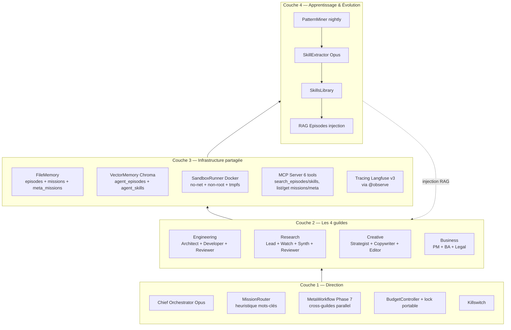
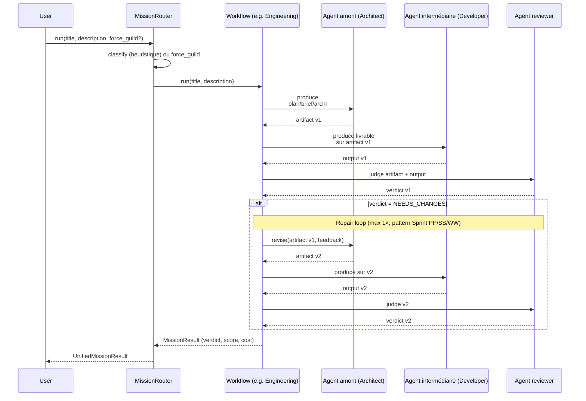
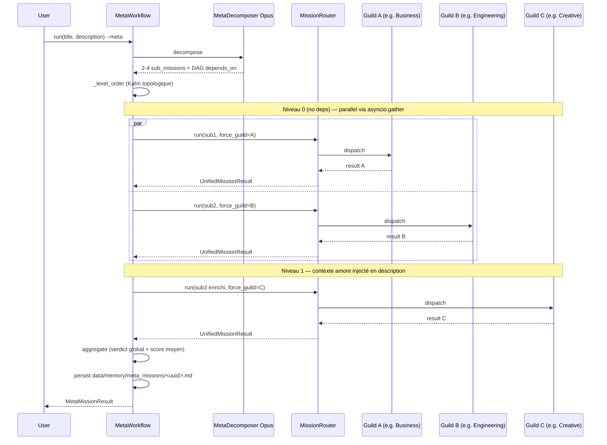

# Architecture — IA Expert Army

> Document vivant — mis à jour à chaque phase.
> Dernière révision : 2026-05-14 (v0.2.0, Phases 0–7 livrées, Sprint XX docs)

---

## Vue d'ensemble — 4 couches



### ASCII fallback (pour `git log` / terminaux sans mermaid)

```
┌──────────────────────────────────────────────────────────────────┐
│  COUCHE 4 — APPRENTISSAGE & ÉVOLUTION                            │
│  Outcome tracking · Pattern mining · Few-shot library            │
│  Prompt refinement loop · Periodic fine-tuning                   │
└──────────────────────────────────────────────────────────────────┘
                              ▲
┌──────────────────────────────────────────────────────────────────┐
│  COUCHE 3 — INFRASTRUCTURE PARTAGÉE                              │
│  Mémoire (Files + Vector DB + KG) · MCP · Bus · Sandbox · Obs.   │
└──────────────────────────────────────────────────────────────────┘
                              ▲
┌──────────────────────────────────────────────────────────────────┐
│  COUCHE 2 — LES 4 GUILDES SPÉCIALISÉES                           │
│  Engineering · Research · Creative · Business                    │
└──────────────────────────────────────────────────────────────────┘
                              ▲
┌──────────────────────────────────────────────────────────────────┐
│  COUCHE 1 — COMITÉ DE DIRECTION                                  │
│  Chief Orchestrator · Chief of Staff · Quality Guardian · Budget │
└──────────────────────────────────────────────────────────────────┘
```

---

## Flow — Mission single-guild (avec repair loop)



**Repair loop : pourquoi tous les agents amont sont ré-exécutés** (et pas juste l'agent intermédiaire) — cf. **Sprint PP** (Business) / **SS** (Engineering) / **WW** (Research+Creative). Un reviewer peut flagger une issue à n'importe quel niveau ; l'agent intermédiaire seul ne peut pas remédier à une faille amont (plan, brief, archi). Pattern uniformé sur les 4 workflows.

---

## Flow — Meta-mission cross-guildes (Phase 7)



**Stratégie de décomposition** : 100 % LLM (Opus), pas d'heuristique. Le décomposeur adapte selon le contexte (diamond, all-parallel, chain). Cf. [ADR-009](adr/009-meta-workflow-cross-guilds.md).

---

## État d'implémentation (v0.2.0) vs Plan stratégique

| Couche | Composant | Statut | Détail |
|---|---|---|---|
| **C1** | Chief Orchestrator | ✅ Livré | `src/orchestrator/agents/orchestrator.py` |
| C1 | Chief of Staff | ⏳ Planifié | Phase 4+ |
| C1 | Quality Guardian | ⏳ Planifié | P2 audit Sprint UU |
| C1 | Budget Controller | ✅ Livré | `src/core/budget.py` + lock portable (Sprint VV) |
| **C2** | 4 guildes opérationnelles | ✅ Livré | 14/25 agents (cf. tableau ci-dessous) |
| C2 | Repair loop uniformé | ✅ Livré | Sprint PP/SS/WW — 4 workflows |
| C2 | MetaWorkflow Phase 7 | ✅ Livré | `src/orchestrator/meta_workflow.py` |
| **C3** | FileMemory (4 niveaux : working/episodes/missions/meta_missions) | ✅ Livré | `src/memory/file_memory.py` |
| C3 | VectorMemory Chroma (in-process) | ✅ Livré | `src/memory/vector_memory.py` |
| C3 | SQLite knowledge graph | ⏳ Planifié | Phase 2+ — actuellement frontmatter YAML suffit |
| C3 | MCP server unifié (6 tools) | ✅ Livré | `src/mcp_servers/memory_search.py` |
| C3 | Redis pubsub bus | ⏳ Planifié | Phase 8+ — pas indispensable v1 |
| C3 | SandboxRunner Docker | ✅ Livré | `src/sandbox/runner.py` (ADR-008) |
| C3 | Langfuse self-hosted + `@observe` | ✅ Livré | Stack docker-compose + tracing opt-in |
| **C4** | PatternMiner + SkillExtractor | ✅ Livré | `src/learning/` (Phase 5) |
| C4 | SkillsLibrary + RAG injection | ✅ Livré | 16 skills auto-générées |
| C4 | Prompt A/B testing | ⏳ Planifié | ADR-007 décrit la stratégie |
| C4 | Fine-tuning périodique | ⏳ Future | Phase 7+ optionnel |

---

## Couche 1 — Comité de direction

| Agent | Modèle | Responsabilité |
|-------|--------|----------------|
| Chief Orchestrator | `claude-opus-4-7` | Reçoit la mission, la décompose, route vers les guildes, arbitre les conflits |
| Chief of Staff | `claude-sonnet-4-6` | Coordonne les guildes, suit la progression, produit les reports |
| Quality Guardian | `claude-opus-4-7` | Validation finale, peer review global, refus si qualité insuffisante |
| Budget Controller | `claude-haiku-4-5-20251001` | Surveille la conso API, déclenche les circuit-breakers |

**Pattern d'orchestration choisi : Supervisor + Workers** (LangGraph).
Le Chief Orchestrator joue le rôle de Supervisor ; les guildes sont des Workers spécialisés.

---

## Couche 2 — Les 4 Guildes (~25 agents)

### Guild Engineering — `src/guilds/engineering/`

| Agent | Modèle | Spécialité |
|-------|--------|------------|
| Software Architect | Opus | Design système, choix technique, ADRs |
| Backend Developer | Sonnet | API, services, DB |
| Frontend Developer | Sonnet | UI, UX, intégrations |
| DevOps Engineer | Sonnet | CI/CD, infra, déploiement |
| QA / Tester | Sonnet | Tests unitaires, e2e, cas limites |
| Security Auditor | Opus | OWASP, secrets, vulnérabilités |
| Code Reviewer | Sonnet | Lecture critique, propositions d'amélioration |
| Technical Writer | Haiku | Documentation, README, ADRs |

### Guild Research — `src/guilds/research/`

| Agent | Modèle | Spécialité |
|-------|--------|------------|
| Research Lead | Opus | Définit la stratégie de recherche |
| Data Analyst | Sonnet | Analyse de jeux de données |
| Document Synthesizer | Sonnet | Résumés, synthèses multi-sources |
| Tech Watch | Haiku | Veille techno (web, RSS, papers) |
| Knowledge Curator | Sonnet | Gère la knowledge base sémantique |

### Guild Creative — `src/guilds/creative/`

| Agent | Modèle | Spécialité |
|-------|--------|------------|
| Content Strategist | Opus | Ligne éditoriale, plans de contenu |
| Copywriter | Sonnet | Rédaction marketing, pages, emails |
| Marketing Specialist | Sonnet | Campagnes, SEO, social |
| Visual Designer | Sonnet + image-gen | Concepts visuels, prompts d'images |
| Editor | Sonnet | Relecture, ton, cohérence |

### Guild Business — `src/guilds/business/`

| Agent | Modèle | Spécialité |
|-------|--------|------------|
| Project Manager | Sonnet | Roadmap, jalons, dépendances |
| Business Analyst | Opus | Marché, modèle économique, KPIs |
| Legal Reviewer | Opus | CGU, RGPD, contrats |
| Finance Analyst | Sonnet | Budget, prévisions, ROI |
| Customer Success | Sonnet | Support, feedback, FAQ |

> **Lazy loading :** un agent n'est instancié que quand une mission le requiert. Pas de coût pour les agents inactifs.

---

## Couche 3 — Infrastructure partagée

### Mémoire à 4 niveaux

Inspirée du modèle cognitif humain.

| Niveau | Stockage | Contenu | Durée |
|--------|----------|---------|-------|
| **Working** | RAM / contexte LLM | Conversation en cours | Session |
| **Episodic** | SQLite | Tâches accomplies, décisions, qui-a-fait-quoi-quand | Permanent |
| **Semantic** | Chroma (vector DB) | Connaissances factuelles, docs, expertise | Permanent |
| **Procedural** | Markdown versionné Git | Procédures réussies, recettes, patterns | Permanent + audit |

**Schéma SQLite (Episodic) :**

```sql
CREATE TABLE missions (
    id TEXT PRIMARY KEY,
    title TEXT NOT NULL,
    requested_at TIMESTAMP NOT NULL,
    completed_at TIMESTAMP,
    status TEXT NOT NULL,          -- pending, in_progress, succeeded, failed, aborted
    quality_score REAL,            -- 0.0 - 1.0 (peer review)
    cost_usd REAL,
    metadata JSON
);

CREATE TABLE episodes (
    id TEXT PRIMARY KEY,
    mission_id TEXT NOT NULL REFERENCES missions(id),
    agent_name TEXT NOT NULL,
    role TEXT NOT NULL,            -- guild member name
    started_at TIMESTAMP NOT NULL,
    ended_at TIMESTAMP,
    input_summary TEXT,
    output_summary TEXT,
    tokens_in INTEGER,
    tokens_out INTEGER,
    cost_usd REAL,
    success BOOLEAN
);

CREATE TABLE decisions (
    id TEXT PRIMARY KEY,
    mission_id TEXT NOT NULL REFERENCES missions(id),
    decided_by TEXT NOT NULL,
    decided_at TIMESTAMP NOT NULL,
    decision TEXT NOT NULL,
    rationale TEXT
);
```

### MCP Servers (custom)

- `memory_mcp` : expose la mémoire 4-niveaux comme outil pour tous les agents
- `skills_mcp` : expose la skills library (lecture + écriture pour patterns appris)
- `sandbox_mcp` : expose l'exécution de code en container
- `web_mcp` : expose une fonction de recherche web filtrée
- `notify_mcp` : envois externes (mail, push) — soumis à approbation

### Bus de messages

Redis pubsub. Topics :

- `agent.{guild}.{role}.task` — assignation de tâche
- `agent.{guild}.{role}.result` — résultat de tâche
- `mission.{id}.update` — mise à jour de mission
- `system.alert` — alertes (budget, sécurité, erreur)
- `system.killswitch` — arrêt d'urgence

### Sandbox d'exécution

- Image base : `python:3.12-slim` (par défaut)
- Réseau : `none` (par défaut, whitelist explicite si besoin)
- Mémoire : 512MB max
- CPU : 1 core max
- Timeout : 30s
- Volume : un seul, en lecture seule, monté sur `/workspace`

### Observabilité

- **Langfuse self-hosted** (port 3000) : traces, spans, scores qualité, coûts
- **Logs structurés** (structlog → JSON) : tous les événements importants
- **Dashboards** : coût/mission, taux de succès, qualité moyenne, patterns appris

---

## Couche 4 — Apprentissage & Évolution

### Outcome tracking

Chaque mission est notée automatiquement :
- Tests passés ? (engineering)
- Quality Guardian a validé ?
- Coût dans le budget ?
- Temps de complétion ?
- Score de feedback utilisateur ?

### Pattern mining

Job nightly qui analyse les `episodes` réussis et extrait :
- Séquences d'actions qui mènent au succès
- Prompts qui produisent des résultats de qualité > N
- Combinaisons d'agents efficaces sur certains types de tâches

### Few-shot library

Stockée dans `skills/` (markdown versionné Git). Format :

```markdown
---
guild: engineering
role: backend_developer
task_type: api_endpoint
quality_score: 0.94
created_at: 2026-06-01
---

## Contexte
Création d'un endpoint REST CRUD avec FastAPI + SQLAlchemy.

## Approche gagnante
1. ...

## Code clé
```python
...
```
```

Au moment d'appeler un agent, le système injecte automatiquement les 2-3 meilleurs exemples
matching le type de tâche dans son contexte.

### Prompt refinement

Les system prompts sont versionnés dans `prompts/` (Git). A/B testing périodique :
- Variant A : prompt actuel
- Variant B : prompt amélioré (généré par Quality Guardian sur la base des échecs)
- Mesure : qualité moyenne sur N missions
- Bascule automatique si B > A avec significance

### Periodic fine-tuning (avancé, optionnel)

Une fois par mois, les meilleurs exemples (`quality_score > 0.9`) sont exportés en JSONL
et utilisés pour fine-tuner Claude Haiku/Sonnet via l'API Anthropic.
Le modèle fine-tuné devient le `MODEL_BULK` ou `MODEL_OPERATIONAL` du domaine.

---

## Garde-fous (mode autonome)

10 garde-fous obligatoires (voir [README.md](../README.md#garde-fous-mode-autonome)).

Implémentation par couche :

| Garde-fou | Couche | Module |
|-----------|--------|--------|
| Sandbox Docker | 3 | `src/sandbox/` |
| Filesystem restreint | 3 | `src/sandbox/policies.py` |
| Whitelist réseau | 3 | `src/sandbox/network.py` |
| Hard cap budget | 1 | `Budget Controller` |
| Circuit breakers | 1 | `Budget Controller` + `Quality Guardian` |
| Approbation humaine | 3 | `src/tools/notify_mcp.py` (HITL) |
| Logs immutables | 3 | Langfuse |
| Killswitch | 1 + 3 | `scripts/killswitch.py` + Redis topic |
| Daily digest | 4 | `scripts/daily_digest.py` (cron) |
| Backups | 4 | `scripts/backup.py` (cron) |

---

## Décisions d'architecture (ADRs)

À mesure que les décisions importantes sont prises, les ADRs sont écrits dans
`docs/adr/NNNN-titre.md`. Format simple :

```markdown
# ADR NNNN — Titre

## Contexte
## Décision
## Conséquences
## Alternatives considérées
```

---

## Roadmap synthétique

| Phase | Livrable principal |
|-------|-------------------|
| 0 | Hello agent + structure + Docker |
| 1 | MVP : 3 agents + workflow simple |
| 2 | Mémoire RAG sur épisodes |
| 3 | Sandbox + bus + observabilité complète |
| 4 | 4 guildes opérationnelles |
| 5 | Apprentissage continu mesurable |
| 6 | Mode pleinement autonome |

Plan stratégique complet : `C:\Users\HP\.claude\plans\bonjour-je-suis-mke-snoopy-sundae.md`
